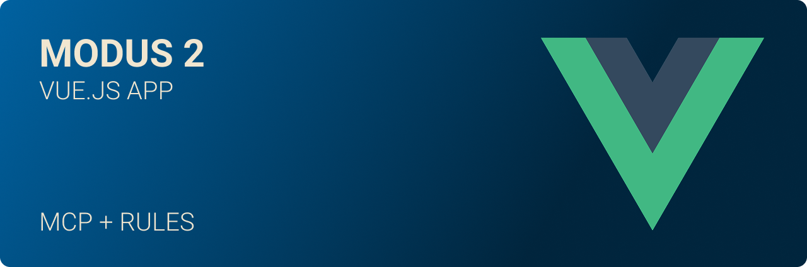
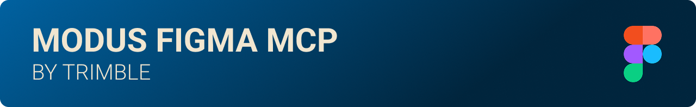

# Modus Vue Boilerplate

A production-ready Vue 3 boilerplate/starter template with Modus 2 Web Components integration, featuring TypeScript support, comprehensive component examples, and modern development practices. Perfect for quickly bootstrapping new applications with the Modus Design System.

## 📋 Built-in Development Rules

This boilerplate comes with comprehensive development rules and standards to ensure code quality and consistency:

### 🎯 Always Applied Rules

- **🎨 Color Usage** - Enforces the 9 approved Modus colors and prevents hardcoded values
- **🧩 Modus Web Components** - Guidelines for proper component implementation with MCP documentation
- **⚡ Vue Component Creation** - Best practices for Vue 3 component architecture and CSS patterns

### 🔧 Context-Specific Rules

- **🎭 Modus Icons** - Complete icon system with 500+ validated icon names
- **🌐 Chrome DevTools Testing** - Browser debugging integration via MCP for implementation testing

> **Location:** All rules are stored in `.cursor/rules/` and automatically guide your development workflow through AI assistants.

## 🤖 AI Development Enhanced

This boilerplate comes pre-configured with powerful AI development tools to supercharge your workflow:

### MCP Servers Included

- **🔧 Context7** - Advanced context management for AI assistants
- **🌐 Chrome DevTools** - Browser debugging integration via MCP
- **📚 Modus Documentation** - Direct access to complete Modus Web Components documentation through AI

### Development Rules & Standards

- **📋 Cursor Rules** - Pre-configured development patterns and best practices
- **🎯 Code Quality** - Automated linting, formatting, and type checking
- **🚀 AI-Optimized Workflow** - Seamless integration with modern AI coding assistants

> **Note:** The `.cursor/` directory contains MCP server configurations and development rules that enhance your AI-assisted development experience. These tools provide instant access to Modus documentation and maintain code quality standards automatically.

## What's Included

This boilerplate provides a complete foundation for building Vue.js applications with Modus Web Components:

- ✅ **Vue 3 + TypeScript** - Modern framework with full type safety
- ✅ **Modus 2 Web Components** - Complete integration with the latest Modus design system
- ✅ **Standard Icon Usage** - Official Modus icon implementation with CDN delivery
- ✅ **Theme Switching** - Support for all Modus themes (Classic/Modern, Light/Dark)
- ✅ **Component Examples** - Comprehensive demos of buttons, icons, alerts, and more
- ✅ **Interactive Demos** - Live component builder and event handling examples
- ✅ **Accessibility** - WCAG 2.1 AA compliant with proper ARIA support
- ✅ **Performance Optimized** - Code splitting, lazy loading, and optimized builds
- ✅ **Development Tools** - ESLint, Prettier, and hot module replacement configured
- ✅ **Production Ready** - Optimized build configuration and deployment setup

## 🎨 Figma to Code Integration



If you're working with Figma designs and want AI-assisted coding that understands your design tokens and components, check out the official Modus Figma MCP integration. This powerful tool bridges the gap between design and development by providing direct access to your Figma designs through AI assistants.

**Learn more:** [Modus Figma MCP Integration Guide](https://trimble-oss.github.io/modus-wc-2.0/main/?path=/docs/documentation-modus-figma-mcp-integration-guide--docs)

> **Perfect for:** Design-to-code workflows, maintaining design system consistency, and accelerating development with AI-powered Figma integration.

##


### Prerequisites

- Node.js 20+ (required for Vite 7.x compatibility)
- npm or yarn

### Installation

1. **Clone or use this template:**

   ```bash
   # Clone the repository
   git clone <your-repo-url> my-modus-app
   cd my-modus-app

   # Or use as a template on GitHub
   # Click "Use this template" button
   ```

2. **Install dependencies:**

   ```bash
   npm install
   ```

3. **Start the development server:**

   ```bash
   npm run dev
   ```

4. **Open your browser:**
   Navigate to your localhost usually it is [http://localhost:3000](http://localhost:3000)

### Build for Production

```bash
npm run build
npm run preview
```

## Project Structure

This boilerplate follows Vue.js best practices with a clean, scalable architecture:

```
modus-vue-app/
├── src/
│   ├── components/          # Reusable Vue components
│   │   └── ModusIcon.vue   # Icon wrapper component
│   ├── views/              # Page components
│   │   ├── Home.vue        # Landing page with examples (can be removed)
│   │   └── ButtonDemo.vue  # Comprehensive component demos  (can be removed)
│   ├── router/             # Vue Router configuration
│   ├── types/              # TypeScript definitions
│   │   └── modus.d.ts      # Modus component types
│   ├── utils/              # Utility functions
│   │   └── icons.ts        # Icon validation and helpers
│   └── main.ts             # Application entry point
├── public/                 # Public assets
├── implementation_guides/  # Where your documentation will be stored
└── .gitignore             # Git ignore configuration
```

## Using This Boilerplate

### Customizing for Your Project

1. **Update project information:**

   - Modify `package.json` with your project details
   - Update the app title in `index.html`
   - Replace demo content in `Home.vue` with your application content

2. **Add your components:**

   - Create new components in `src/components/`
   - Add new pages in `src/views/`
   - Update routing in `src/router/index.ts`

3. **Configure your build:**
   - Modify `vite.config.ts` for your deployment needs
   - Update environment variables as needed
   - Configure additional build optimizations

### Example Components Included

The boilerplate includes comprehensive examples of:

- **Buttons** - All variants, colors, sizes, and shapes with interactive builder
- **Icons** - Complete icon system with standard Modus implementation
- **Alerts** - Success, warning, error, and info messages
- **Theme Switching** - Dynamic theme changes with persistence
- **Form Integration** - Proper form handling with Modus components
- **Event Handling** - Complete event management examples

## Modus Web Components Integration

### Basic Usage

```vue
<template>
  <!-- Direct web component usage -->
  <modus-wc-button color="primary" @click="handleClick">
    <i class="modus-icons" style="margin-right: 8px">save_disk</i>
    Save Changes
  </modus-wc-button>

  <!-- Using the ModusIcon wrapper -->
  <ModusIcon
    name="settings"
    size="lg"
    :decorative="false"
    aria-label="Settings"
  />
</template>

<script setup lang="ts">
import ModusIcon from "@/components/ModusIcon.vue";

const handleClick = () => {
  console.log("Button clicked!");
};
</script>
```

### Available Components

This boilerplate includes comprehensive examples of:

- **Buttons** - All variants, colors, sizes, and shapes
- **Icons** - Complete icon system with standard Modus implementation
- **Alerts** - Success, warning, error, and info messages
- **Theme Switching** - Dynamic theme changes

## Icon System

### Standard Modus Icons

Icons are loaded from the Modus CDN and use the standard `<i class="modus-icons">icon_name</i>` pattern:

```typescript
import "@trimble-oss/modus-icons/dist/field-systems/fonts/modus-icons.css";
```

### Usage Examples

```vue
<template>
  <!-- Basic icon usage -->
  <i class="modus-icons">settings</i>

  <!-- Icon with styling -->
  <i class="modus-icons icon-lg icon-primary">{{ iconName }}</i>

  <!-- Using the ModusIcon wrapper -->
  <ModusIcon
    name="settings"
    size="lg"
    :decorative="false"
    aria-label="Settings"
  />
</template>

<script setup lang="ts">
import ModusIcon from "@/components/ModusIcon.vue";
import type { ModusIconName } from "@/types/modus";

const iconName: ModusIconName = "settings";
</script>
```

### Available Icon Categories

The application now includes the complete list of all official Modus icons with full TypeScript support:

- **Actions**: add, edit_combination, delete, save_disk, download, upload, copy_content, refresh, sync
- **Navigation**: arrow_left, arrow_right, arrow_up, arrow_down, chevron_left, chevron_right, home, dashboard, menu, close
- **Interface**: search, filter, settings, launch, more_horizontal, more_vertical, sort, view_grid, view_list
- **Status**: check, check_circle, warning, info, alert, help, cancel_circle
- **Content**: file, folder_open, folder_closed, document, image, video, camera
- **User**: person, people_group, user_account, sign_in, sign_out, lock, lock_open
- **Communication**: email, phone, chat, comment, notifications
- **UI**: palette, brightness, visibility_on, visibility_off, toggle_on, toggle_off

**Total Icons Available**: 500+ official Modus icons with complete TypeScript definitions

## Theme System

### Available Themes

- `modus-classic-light` (default)
- `modus-classic-dark`
- `modus-modern-light`
- `modus-modern-dark`

### Theme Switching

```typescript
// Programmatic theme switching
const changeTheme = (theme: string) => {
  document.documentElement.setAttribute("data-theme", theme);
  localStorage.setItem("modus-theme", theme);
};
```

## TypeScript Support

Full TypeScript support with:

- **Component Props** - Type-safe Modus component properties
- **Event Handlers** - Proper CustomEvent typing
- **Icon Names** - Validated icon name types
- **Theme Values** - Type-safe theme switching

```typescript
// Type definitions for Modus components
declare global {
  namespace JSX {
    interface IntrinsicElements {
      "modus-wc-button": {
        color?: "primary" | "secondary" | "tertiary" | "warning" | "danger";
        variant?: "filled" | "outlined" | "borderless";
        size?: "xs" | "sm" | "md" | "lg";
        shape?: "rectangle" | "square" | "circle";
        disabled?: boolean;
        "full-width"?: boolean;
        // ... more properties
      };
      "modus-wc-alert": {
        variant?: "success" | "warning" | "error" | "info";
        "alert-title"?: string;
        dismissible?: boolean;
      };
    }
  }
}
```

## Performance Features

### Code Splitting

- **Route-based splitting** - Each page loads independently
- **Component chunking** - Modus components are bundled separately
- **Vendor separation** - Vue and utilities in separate chunks

### Icon Optimization

- **Critical icon preloading** - Essential icons load immediately
- **Lazy loading** - Non-critical icons load on demand
- **Font display optimization** - `font-display: swap` for better performance

### Build Optimization

- **Tree shaking** - Unused code is eliminated
- **Asset optimization** - Images and fonts are optimized
- **Source maps** - Available for debugging

## Browser Support

- **Modern browsers** - Chrome 90+, Firefox 88+, Safari 14+, Edge 90+
- **Mobile support** - iOS Safari 14+, Chrome Mobile 90+
- **Accessibility** - Screen readers and assistive technologies
- **High contrast** - Windows high contrast mode support

## Development Scripts

```bash
# Development server with hot reload
npm run dev

# Type checking
npm run type-check

# Production build
npm run build

# Preview production build
npm run preview

# Check for non-Modus color usage
npm run lint:colors
```

## Code Quality & Linting

### Modus Color Enforcement

This boilerplate includes a pre-commit hook that automatically checks for non-Modus color usage:

- **Detects Tailwind colors** - Flags usage of `red-400`, `blue-500`, etc.
- **Detects hardcoded colors** - Catches hex codes like `#ff0000`, RGB values, and Modus hex values
- **Suggests Modus alternatives** - Provides proper Modus CSS custom properties
- **Runs on commit** - Automatically validates staged files before commit

**Example violations caught:**

```css
/* ❌ Will be flagged */
.button {
  background-color: red-500; /* Tailwind color */
  color: #f1f1f6; /* Hardcoded Modus hex */
}
.text {
  color: rgb(23, 28, 30); /* RGB equivalent of Modus color */
}

/* ✅ Correct Modus usage */
.button {
  background-color: var(--modus-wc-color-error);
  color: var(--modus-wc-color-base-100);
}
.text {
  color: var(--modus-wc-color-base-content);
}
```

**Available Modus Color Variables (9 colors total):**

**Base Colors (5 total):**

- `var(--modus-wc-color-base-page)` - Background: #fff (light) / #000 (dark)
- `var(--modus-wc-color-base-100)` - Light gray: #f1f1f6 (light) / #252a2e (dark)
- `var(--modus-wc-color-base-200)` - Medium gray: #cbcdd6 (light) / #464b52 (dark)
- `var(--modus-wc-color-base-300)` - Dark gray: #b7b9c3 (light) / #353a40 (dark)
- `var(--modus-wc-color-base-content)` - Text: #171c1e (light) / #cbcdd6 (dark)

**Semantic Colors (4 total - same in both themes):**

- `var(--modus-wc-color-info)` - Blue: #0063a3
- `var(--modus-wc-color-success)` - Green: #1e8a44
- `var(--modus-wc-color-error)` - Red: #da212c
- `var(--modus-wc-color-warning)` - Orange: #fbad26

> **Note:** Component props like `primary`, `secondary`, `tertiary`, and `danger` map to these CSS variables internally.

## Deployment

This boilerplate is ready for deployment to various platforms:

### Static Hosting (Netlify, Vercel, GitHub Pages)

```bash
npm run build
# Deploy the dist/ folder
```

## Customization

### Adding New Components

1. **Install additional Modus components** if needed
2. **Add TypeScript definitions** in `src/types/modus.d.ts`
3. **Create wrapper components** in `src/components/`
4. **Add examples** in the demo pages or remove demo content for production

### Custom Styling

Use Modus CSS custom properties for consistent theming:

```css
.custom-component {
  background-color: var(--modus-wc-color-base-100);
  color: var(--modus-wc-color-base-content);
  border: 1px solid var(--modus-wc-color-base-200);
}

/* Status-specific styling */
.success-message {
  color: var(--modus-wc-color-success);
  border-left: 3px solid var(--modus-wc-color-success);
}

.error-message {
  color: var(--modus-wc-color-error);
  border-left: 3px solid var(--modus-wc-color-error);
}
```

## Troubleshooting

### Icons Not Displaying

1. **Check font loading** - Ensure Modus icons CSS is imported
2. **Verify icon names** - Use only valid Modus icon names
3. **Check network** - CDN may be blocked in some environments

### Components Not Rendering

1. **Verify imports** - Ensure Modus components are imported
2. **Check custom elements** - Vite should recognize `modus-wc-*` tags
3. **Browser support** - Ensure browser supports web components

### Theme Issues

1. **HTML attribute** - Ensure `data-theme` is set on `<html>`
2. **CSS loading order** - Modus styles should load before custom styles
3. **Local storage** - Theme preference should persist across sessions

## Contributing

When contributing to this boilerplate:

1. **Follow Vue 3 best practices**
2. **Maintain TypeScript strict mode**
3. **Use Modus design tokens**
4. **Test across all themes**
5. **Ensure accessibility compliance**
6. **Update documentation as needed**

## Support & Resources

- [Modus Web Components Documentation](https://trimble-oss.github.io/modus-wc-2.0/main/)
- [Vue 3 Documentation](https://vuejs.org/)
- [Vite Documentation](https://vitejs.dev/)
- [TypeScript Documentation](https://www.typescriptlang.org/)

## License

MIT License - see LICENSE file for details.

---

**Ready to build amazing applications with Modus Design System and Vue 3! 🚀**

This boilerplate provides everything you need to get started quickly while following best practices and maintaining high code quality.

---

## Creator

**Made with ❤️ by [Julian Oczkowski](https://github.com/julianoczkowski)**

_Lead Product Designer bridging UX & Code • Building AI-driven tools, design systems, and digital products_

🎥 [YouTube](https://www.youtube.com/@julianoczkowski) • 💼 [LinkedIn](https://linkedin.com/in/julianoczkowski) • 🌐 [Website](https://www.julianoczkowski.com)

_Created for the Trimble community and developers worldwide_ 🌍
