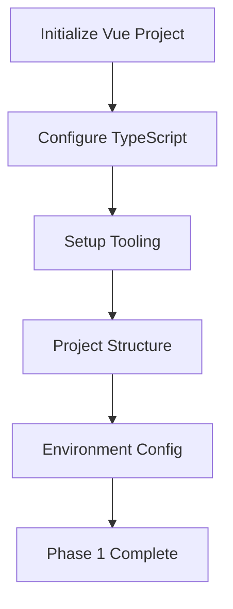
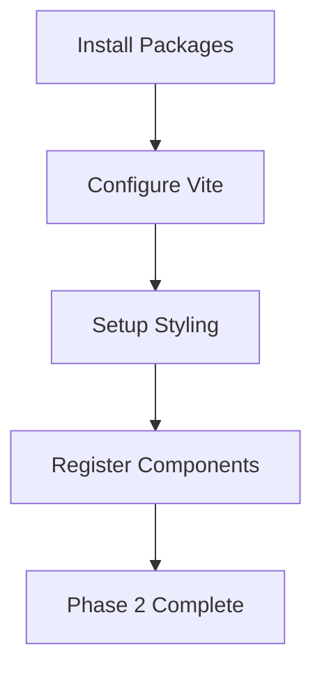
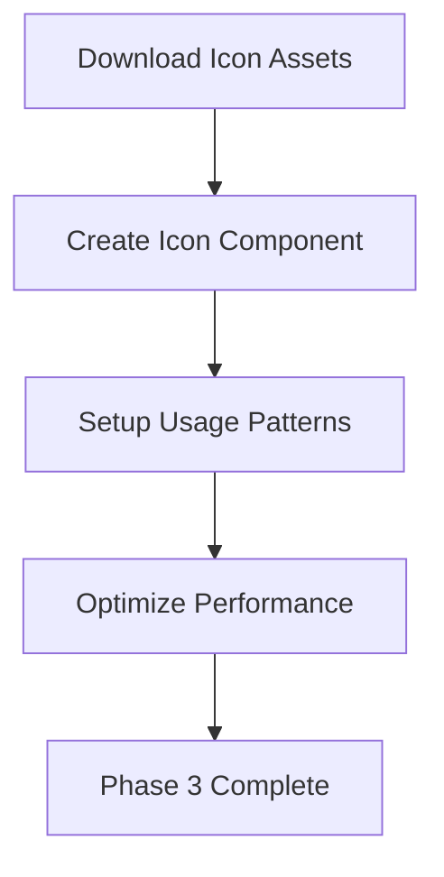
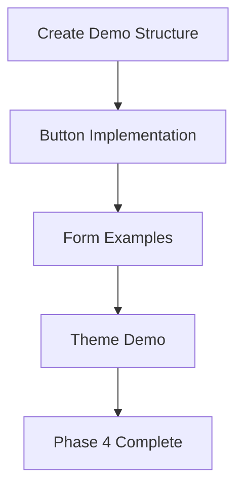
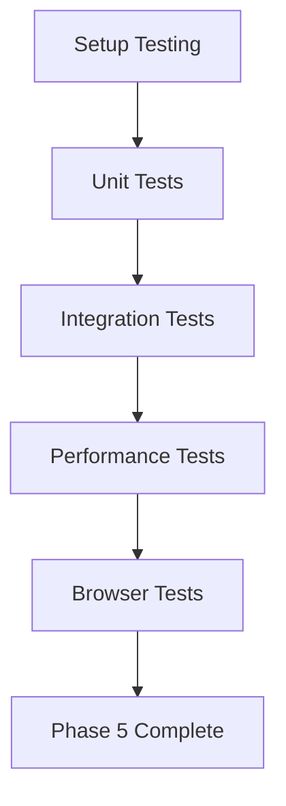
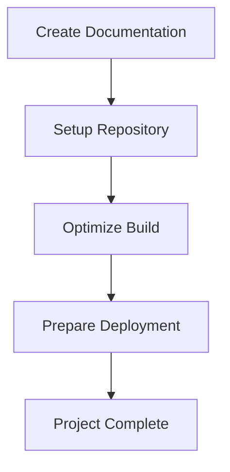

# Modus Vue Web Components Implementation Plan

## Project Overview

This plan outlines the comprehensive setup of a new Vue.js application integrated with Modus 2 Web Components, including offline icon usage and a demo implementation.

## Target Personas

**Primary Users:**

- **Frontend Developers** - Need a reliable, modern component library for rapid application development
- **UI/UX Designers** - Require consistent design system implementation with proper theming support
- **Product Teams** - Want standardized components that maintain brand consistency across applications

**Secondary Users:**

- **DevOps Engineers** - Need optimized build processes and deployment strategies
- **QA Engineers** - Require accessible, testable components with proper ARIA support

## User Stories

### As a Frontend Developer...

- I want to quickly scaffold a Vue application with Modus components so I can focus on business logic rather than UI implementation
- I want proper TypeScript support for Modus components so I can catch errors at compile time
- I want offline icon support so my application works without external dependencies
- I want clear documentation and examples so I can implement features efficiently

### As a UI/UX Designer...

- I want consistent theming across all components so the application maintains visual cohesion
- I want access to the complete Modus design system so I can create pixel-perfect implementations
- I want theme switching capabilities so users can choose their preferred appearance

### As a Product Team Member...

- I want standardized components that follow accessibility guidelines so we meet compliance requirements
- I want responsive components that work across all device sizes so we provide a great user experience
- I want a maintainable codebase that can scale with our product requirements

## Implementation Phases

### Phase 1: Project Foundation & Setup

**Objective:** Establish the base Vue application with proper tooling and configuration

#### 1.1 Vue Application Initialization

- Create new Vue 3 application using Vite
- Configure TypeScript support for better development experience
- Set up ESLint and Prettier for code quality
- Initialize Git repository with proper .gitignore

#### 1.2 Project Structure Setup

- Create organized folder structure following Vue best practices
- Set up assets, components, views, and utilities directories
- Configure path aliases for cleaner imports
- Create environment configuration files

#### 1.3 Development Environment Configuration

- Configure Vite for optimal development experience
- Set up hot module replacement for rapid development
- Configure build optimization settings
- Set up development server with proper CORS handling

### Phase 2: Modus Web Components Integration

**Objective:** Install and configure Modus Web Components with proper Vue integration

#### 2.1 Package Installation

- Install @trimble-oss/moduswebcomponents core package
- Install @trimble-oss/moduswebcomponents-vue for Vue-specific bindings
- Install @trimble-oss/modus-icons for comprehensive icon support
- Lock package versions to prevent breaking changes

#### 2.2 Vue Configuration for Web Components

- Configure Vite to recognize Modus custom elements
- Set up proper module resolution for web components
- Configure build process to handle web component assets
- Add proper TypeScript declarations for components

#### 2.3 Styling and Theme Integration

- Import Modus CSS styles in main application file
- Configure CSS custom properties for theming support
- Set up theme switching infrastructure
- Ensure proper CSS loading order and optimization

#### 2.4 Component Registration

- Register Modus Vue components globally or locally
- Set up proper component imports and exports
- Configure component prop types and event handling
- Ensure proper SSR compatibility if needed

### Phase 3: Offline Icon System Implementation

**Objective:** Set up comprehensive offline icon support with proper optimization

#### 3.1 Icon Asset Management

- Download and bundle Modus icon fonts locally
- Set up icon sprite generation for optimal performance
- Configure proper font loading strategies
- Implement icon caching mechanisms

#### 3.2 Icon Component Creation

- Create reusable Vue icon component wrapper
- Implement proper icon validation and fallbacks
- Add TypeScript support for icon names
- Set up accessibility features for icons

#### 3.3 Icon Usage Patterns

- Document proper icon implementation patterns
- Create icon showcase component for development
- Set up icon search and discovery tools
- Implement icon optimization strategies

#### 3.4 Performance Optimization

- Implement lazy loading for non-critical icons
- Set up icon tree-shaking for unused icons
- Configure proper caching headers for icon assets
- Optimize icon loading for different network conditions

### Phase 4: Demo Application Development

**Objective:** Create a comprehensive demo showcasing Modus components and best practices

#### 4.1 Demo Page Structure

- Create main demo page with navigation
- Implement component showcase sections
- Add interactive examples for each component
- Set up proper routing for multi-page demos

#### 4.2 Button Component Implementation

- Implement all button variants (filled, outlined, borderless)
- Showcase all button colors and sizes
- Demonstrate icon integration with buttons
- Add interactive controls for testing different states

#### 4.3 Form Integration Examples

- Create comprehensive form examples using Modus components
- Implement validation patterns with proper error handling
- Showcase accessibility features and keyboard navigation
- Add responsive design demonstrations

#### 4.4 Theme Demonstration

- Implement theme switcher component
- Demonstrate all available Modus themes
- Show proper CSS custom property usage
- Create theme-aware component examples

### Phase 5: Testing & Quality Assurance

**Objective:** Ensure comprehensive testing coverage and quality standards

#### 5.1 Unit Testing Setup

- Configure Vitest for component testing
- Set up Vue Testing Library for component interactions
- Create test utilities for Modus components
- Implement snapshot testing for visual consistency

#### 5.2 Integration Testing

- Test component integration and prop passing
- Verify event handling and custom events
- Test theme switching functionality
- Validate accessibility compliance

#### 5.3 Performance Testing

- Measure bundle size and loading performance
- Test icon loading and caching strategies
- Validate responsive design across devices
- Check memory usage and cleanup

#### 5.4 Browser Compatibility

- Test across modern browsers (Chrome, Firefox, Safari, Edge)
- Verify mobile browser compatibility
- Test with screen readers and assistive technologies
- Validate print styles and high contrast modes

### Phase 6: Documentation & Deployment

**Objective:** Create comprehensive documentation and prepare for production deployment

#### 6.1 Documentation Creation

- Write comprehensive setup and usage documentation
- Create component API documentation
- Document theming and customization options
- Add troubleshooting guides and FAQs

#### 6.2 Example Repository

- Create clean, well-commented example code
- Add README with quick start instructions
- Include deployment guides for common platforms
- Set up GitHub repository with proper documentation

#### 6.3 Build Optimization

- Configure production build settings
- Implement code splitting for optimal loading
- Set up proper asset optimization
- Configure caching strategies

#### 6.4 Deployment Preparation

- Set up CI/CD pipeline configuration
- Create Docker configuration if needed
- Document environment variable requirements
- Prepare monitoring and logging setup

## Technical Requirements

### Dependencies

- **Vue 3.4+** - Latest stable version with Composition API
- **Vite 5.0+** - Modern build tool with fast HMR
- **TypeScript 5.0+** - Type safety and developer experience
- **@trimble-oss/moduswebcomponents 2.0+** - Core component library
- **@trimble-oss/moduswebcomponents-vue 2.0+** - Vue integration layer
- **@trimble-oss/modus-icons** - Complete icon library

### Browser Support

- **Modern Browsers:** Chrome 90+, Firefox 88+, Safari 14+, Edge 90+
- **Mobile:** iOS Safari 14+, Chrome Mobile 90+
- **Accessibility:** WCAG 2.1 AA compliance
- **Performance:** Core Web Vitals optimization

### Development Tools

- **ESLint** - Code linting with Vue and TypeScript rules
- **Prettier** - Code formatting for consistency
- **Vitest** - Fast unit testing framework
- **Vue Testing Library** - Component testing utilities

## Architecture Decisions

### Component Strategy

- **Wrapper Components:** Create Vue wrapper components for complex Modus components
- **Direct Usage:** Use Modus web components directly for simple implementations
- **Type Safety:** Provide comprehensive TypeScript definitions
- **Accessibility:** Ensure all components meet WCAG guidelines

### State Management

- **Local State:** Use Vue 3 Composition API for component-level state
- **Global State:** Implement Pinia for application-level state if needed
- **Theme State:** Use reactive theme management for consistent theming

### Performance Strategy

- **Code Splitting:** Implement route-based and component-based code splitting
- **Lazy Loading:** Load non-critical components and icons on demand
- **Caching:** Implement proper browser caching for static assets
- **Bundle Optimization:** Use tree-shaking and dead code elimination

## Success Metrics

### Development Experience

- **Setup Time:** Complete setup in under 30 minutes
- **Documentation Quality:** Comprehensive guides with working examples
- **Type Safety:** 100% TypeScript coverage for component props and events
- **Developer Satisfaction:** Positive feedback from development team

### Performance Targets

- **First Contentful Paint:** < 1.5 seconds
- **Largest Contentful Paint:** < 2.5 seconds
- **Cumulative Layout Shift:** < 0.1
- **Bundle Size:** < 500KB gzipped for initial load

### Quality Standards

- **Accessibility:** WCAG 2.1 AA compliance
- **Browser Support:** 95%+ compatibility across target browsers
- **Test Coverage:** 80%+ unit test coverage
- **Code Quality:** ESLint and Prettier compliance

## Risk Mitigation

### Technical Risks

- **Version Compatibility:** Lock package versions and test updates thoroughly
- **Bundle Size:** Monitor bundle size and implement lazy loading strategies
- **Browser Support:** Test across target browsers and provide fallbacks
- **Performance:** Regular performance audits and optimization

### Project Risks

- **Timeline:** Build in buffer time for testing and documentation
- **Scope Creep:** Clearly define MVP and additional features
- **Team Knowledge:** Provide comprehensive documentation and training
- **Maintenance:** Plan for ongoing updates and security patches

## Conclusion

This implementation plan provides a structured approach to integrating Modus 2 Web Components with Vue.js, ensuring a robust, performant, and maintainable solution. The phased approach allows for iterative development while maintaining quality standards throughout the process.

The plan emphasizes developer experience, performance optimization, and accessibility compliance, making it suitable for production applications while providing a solid foundation for future enhancements.
